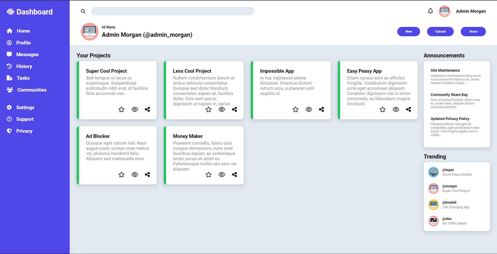

# Odin Project - Admin Dashboard

Quick and simple admin dashboard from the Odin Project curriculum.

## Table of contents

- [Overview](#overview)
  - [Screenshot](#screenshot)
  - [Links](#links)
- [My process](#my-process)
  - [What I learned](#what-i-learned)

## Overview

### Screenshot



### Links

- Live Site URL: [Live Site](https://classy-pixie-21cb53.netlify.app/)

## My Process

- Semantic HTML5 markup
- CSS custom properties
- CSS Grid
- Flexbox

### What I learned

How to use grid-template-area and define them

```css
body {
	display: grid;
	grid-template-columns: 300px 1fr;
	grid-template-rows: auto 1fr;
	grid-template-areas:
		'sidebar header'
		'sidebar contents';
}

.header {
	grid-area: header;
}
```
